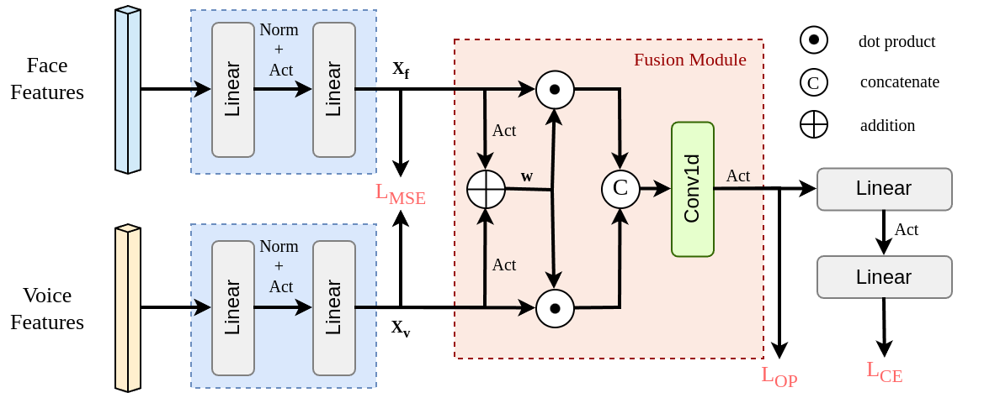

# Rethinking Fusion and Orthogonal Projection for Face-Voice Association (FAME 2026)

The paper is available [arxiv](https://arxiv.org/abs/2512.02860)

## Overview

## Architecture


### Installation
Please follow the instructions [here](https://github.com/msaadsaeed/FOP) to make the environment and install the libraries.

## Training
Use following command to train the model
```
python main.py --save_dir ./model --lr 2e-5 --batch_size 1024 --max_num_epoch 50 --dim_embed 256 \
--train_path_face <path_to_train_face_features> \
--train_path_voice <path_to_train_voice_features> \
--test_path_face <path_to_test_face_features> \
--test_path_voice <path_to_test_voice_features>
```

## Testing
Use following command to test the trained model
```
python test.py --ckpt <path to checkpoint.pth.tar> --dim_embed 256 
```

Download model weights from [here]()


## Acknowledgements
The codebase is inspired from the [FOP](https://github.com/msaadsaeed/FOP) repository. We thank them for releasing their valuable codebase. 

## Citation
```
```
